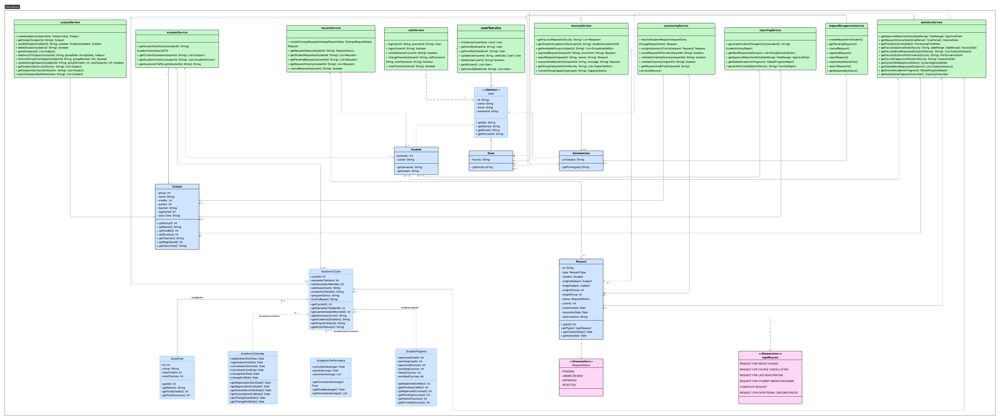

# TEEN_TITANS_BACK

**Integrantes :**
- Sebastian Albarracin Silva
- Raquel Iveth Selma Ayala
- Juan Pablo Nieto Cortes
- Deisy Lorena Guzman Cabrales
  
---

#  SIRHA - Sistema de Reasignación de Horarios Académicos

> Sistema web para la gestión de solicitudes de cambio de materias y grupos con trazabilidad, priorización y control de capacidad.

---

## Objetivo del Proyecto

Facilitar la gestión de solicitudes de cambio de materia y grupo por parte de los estudiantes, con trazabilidad, priorización y control de capacidad, brindando a profesores y decanaturas las herramientas necesarias para evaluar y aprobar dichas solicitudes.

---

### Estrategia de Versionamiento y Convención de Commits

#### Flujo de Ramas (Git Flow)
- **`main`** → rama estable (producción)
- **`develop`** → integración continua (nuevas funcionalidades probadas)
- **`feature/*`** → desarrollo de nuevas funcionalidades
- **`hotfix/*`** → correcciones urgentes en producción
- **`release/*`** → preparación de releases antes de pasar a producción

#### Convención de Commits
Los commits deben ser claros, breves y con un prefijo que indique el propósito:

- **`feat:`** nueva funcionalidad
- **`fix:`** corrección de errores
- **`docs:`** cambios en la documentación
- **`style:`** formato (espacios, punto y coma, estilo de código, etc.)
- **`refactor:`** refactorización de código sin cambiar la funcionalidad
- **`test:`** adición o corrección de pruebas
- **`chore:`** actualización de dependencias, configuración o tareas varias

#### Ejemplos de Commits
- `feat: implementar creación de solicitudes de cambio`
- `fix: corregir validación de cruce de horarios`
- `docs: actualizar README con diagramas de arquitectura`

---

### SCRUM - JIRA
- **Tablero JIRA**: [Tablero SIRHA](https://mail-team-l5ows73z.atlassian.net/jira/software/projects/SCRUM/boards/1?atlOrigin=eyJpIjoiMWM3NTI5N2NjMDQ5NGEwNzkzYjMwZWIzMWI0NzM1NDgiLCJwIjoiaiJ9)
- **Backlog** priorizado con Historias de Usuario
- **Sprint Backlog** con tareas específicas
- **Sprints completados**
- **Evidencias de dailies y distribución de roles**

---
##  Módulos Principales

- **Gestión de Estudiantes**: Registro, autenticación, consulta de horarios, creación y seguimiento de solicitudes.
- **Gestión por Decanatura**: Revisión, aprobación o rechazo de solicitudes, control de cupos y periodos.
- **Gestión de Grupos y Materias**: Administración de cupos, horarios y profesores.
- **Reportes y Estadísticas**: Historial de cambios, tasas de aprobación, indicadores de avance.

---

## 🛠 Tecnologías Implementadas

### Backend
- Java 17 + Spring Boot 3.x
- PostgreSQL
- JWT para autenticación
- JUnit 5 + Mockito para pruebas
- Jacoco para cobertura
- SonarQube para análisis estático

### Frontend
### Frontend
- [TEEN_TITANS_FRONT](https://github.com/JuanPablo990/TEEN_TITANS_FRONT.git)
- [Lucidchart From](https://lucid.app/lucidchart/1ccd2b6c-b8ad-4b9f-941c-f6828e9532d4/edit?view_items=qrGRL0G_4Eiz&invitationId=inv_7ed48e88-6bab-4d4c-9bd2-3f7fd4c4fed7)

### Herramientas
- Git & GitHub
- JIRA Software
- Slack para comunicación
- Swagger para documentación
- Lucidchart para diagramas

---

## **Diagramas incluidos:**

###  Diagrama de Contexto

###  Diagrama de casos de uso

###  Diagrama de clases 

### Diagrama de Componentes

### Diagrama de Secuencias

### Modelo de Base de Datos