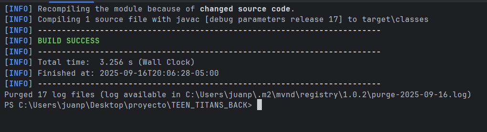
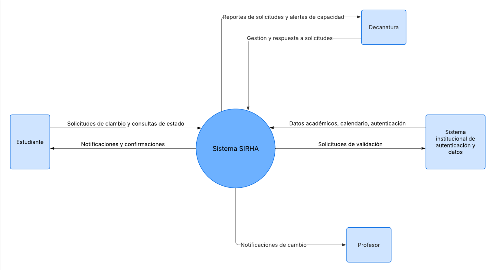
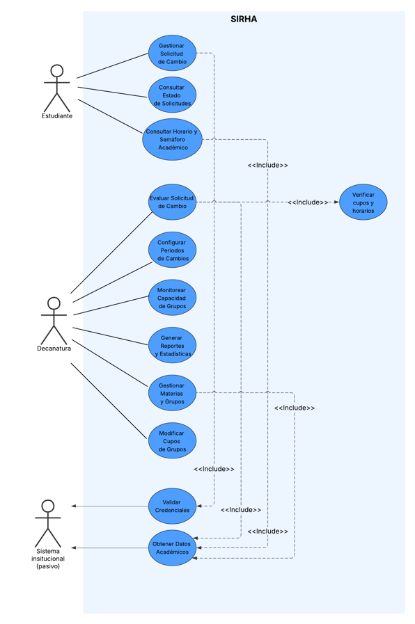

# TEEN_TITANS_BACK

**Integrantes :**
- Sebastian Albarracin Silva
- Raquel Iveth Selma Ayala
- Juan Pablo Nieto Cortes
- Deisy Lorena Guzman Cabrales 
'
## Maven Corriendo

1. **Identificación de requisitos:**

# 1. Reglas de Negocio

Las reglas de negocio son las políticas, restricciones y condiciones que el sistema debe hacer cumplir.

- **RN-01:** Los estudiantes solo pueden generar solicitudes de cambio dentro de las fechas habilitadas por la institución.
- **RN-02:** Un estudiante no puede solicitar cambio de una materia que ya ha cancelado en el mismo semestre.
- **RN-03:** La prioridad de una solicitud se asigna automáticamente por orden de llegada (número de radicado).
- **RN-04:** Una decanatura solo puede gestionar solicitudes de las materias bajo su facultad.
- **RN-05:** No se puede aprobar un cambio si el grupo destino ya está lleno (al 100% de su capacidad).
- **RN-06:** Las solicitudes deben ser resueltas (aprobadas o rechazadas) en un plazo máximo definido (ej. 5 días hábiles).
- **RN-07:** Solo usuarios con rol de administrador o decanatura pueden modificar los cupos de los grupos.
- **RN-08:** No se pueden aprobar solicitudes fuera del calendario académico establecido.
- **RN-09:** No se permiten cupos en un grupo superiores al máximo definido para él.
- **RN-10:** No se puede aprobar un cambio si este genera cruce de horarios con las materias obligatorias del estudiante.
- **RN-11:** La autenticación en el sistema se realiza únicamente con credenciales institucionales.
- **RN-12:** El sistema debe alertar cuando un grupo llega al 90% de su capacidad.

# 2. Funcionalidades Principales

Agrupadas por los módulos descritos en el documento.

## Módulo de Gestión de Estudiantes

- Autenticación de estudiantes.
- Consulta de horario actual e histórico.
- Visualización del semáforo académico (estado de avance en el plan de estudios).
- Creación de solicitudes de cambio (especificando materia problema, sugerencia y observaciones).
- Consulta del estado e historial de las solicitudes propias.

## Módulo de Gestión por Decanatura

- Consulta y filtrado de solicitudes recibidas para su facultad.
- Visualización del horario y semáforo académico del estudiante solicitante.
- Consulta de disponibilidad de grupos alternos (capacidad, cupo máximo, lista de espera).
- Toma de decisión sobre solicitudes (Aprobar, Rechazar, Solicitar más información).
- Aprobación especial de casos excepcionales.
- Configuración de los periodos habilitados para cambios.
- Monitoreo de la capacidad de los grupos (con alertas al 90%).

## Módulo de Gestión de Grupos y Materias (Admin)

- Registro y administración de materias, grupos y sus cupos máximos.
- Asignación de profesores a grupos.
- Administración de horarios disponibles.

## Módulo Central de Gestión de Solicitudes

- Recepción y radicación automática de solicitudes.
- Ruteo automático de solicitudes a la facultad correspondiente.
- Registro de la trazabilidad de todas las decisiones.
- Generación de reportes de estados (pendientes, aprobadas, rechazadas) y estadísticas.

## Módulo de Reportes y Estadísticas

- Generación de reportes de historial de cambios por estudiante.
- Estadísticas de grupos más solicitados y tasas de aprobación/rechazo.
- Indicadores globales de avance en planes de estudio (semaforización).

# 3. Actores Principales

- **Estudiante:** Usuario que consulta su información académica y crea solicitudes de cambio.
- **Decano / Personal de Decanatura:** Usuario que revisa, evalúa y decide sobre las solicitudes de cambio de los estudiantes de su facultad. También configura periodos de solicitud.
- **Administrador del Sistema:** Usuario que gestiona la base de datos del sistema: materias, grupos, cupos, horarios y profesores. Tiene los permisos más elevados.

# 4. Precondiciones del Sistema

Estas son las condiciones que deben cumplirse para que el sistema pueda funcionar correctamente.

- **Existencia de Usuarios:** Debe existir una base de datos de usuarios (estudiantes, decanos, administradores) con sus credenciales institucionales y roles definidos.
- **Base de Datos Académica:** El sistema debe tener acceso a o contener la información de:
    - Planes de estudio y materias por programa.
    - Horarios y grupos disponibles para el semestre vigente.
    - Cupos máximos definidos para cada grupo.
    - Profesores asignados a cada grupo.
- **Calendario Académico Configurado:** Deben estar definidos y configurados en el sistema los periodos habilitados para realizar solicitudes de cambio.
- **Información de Estudiantes:** El sistema debe poder acceder a la información histórica de cada estudiante:
    - Horarios de semestres anteriores.
    - Materias aprobadas y cursadas para calcular el semáforo académico.
    - Materias en las que está inscrito actualmente.
- **Reglas de Negocio Implementadas:** Las validaciones clave (límite de cupos, cruce de horarios, fechas permitidas) deben estar programadas e integradas en el flujo de aprobación de solicitudes.  

# 5. Diagrama de Contexto 

# 6. Diagrama de casos de uso 

