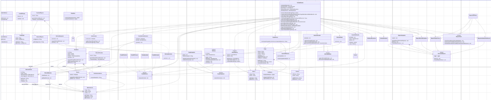

# TEEN_TITANS_BACK

**Integrantes :**
- Sebastian Albarracin Silva
- Raquel Iveth Selma Ayala
- Juan Pablo Nieto Cortes
- Deisy Lorena Guzman Cabrales
  '
## Maven Corriendo
.
- **RN-04:** Una decanatura solo puede gestionar solicitudes de las materias bajo su facultad.
- **RN-05:** No se puede aprobar un cambio si el grupo destino ya está lleno (al 100% de su capacidad).
- **RN-06:** Las solicitudes deben ser resueltas (aprobadas o rechazadas) en un plazo máximo definido (ej. 5 días hábiles).
- **RN-07:** Solo usuarios con rol de administrador o decanatura pueden modificar los cupos de los grupos.
- **RN-08:** No se pueden aprobar solicitudes fuera del calendario académico establecido.
- **RN-09:** No se permiten cupos en un grupo superiores al máximo definido para él.
- **RN-10:** No se puede aprobar un cambio si este genera cruce de horarios con las materias obligatorias del estudiante.
- **RN-11:** La autenticación en el sistema se realiza únicamente con credenciales institucionales.
- **RN-12:** El sistema debe alertar cuando un grupo llega al 90% de su capacidad.

# 2. Funcionalidades Principales

Agrupadas por los módulos descritos en el documento.

## Módulo de Gestión de Estudiantes

- Autenticación de estudiantes.
- Consulta de horario actual e histórico.
- Visualización del semáforo académico (estado de avance en el plan de estudios).
- Creación de solicitudes de cambio (especificando materia problema, sugerencia y observaciones).
- Consulta del estado e historial de las solicitudes propias.

## Módulo de Gestión por Decanatura

- Consulta y filtrado de solicitudes recibidas para su facultad.
- Visualización del horario y semáforo académico del estudiante solicitante.
- Consulta de disponibilidad de grupos alternos (capacidad, cupo máximo, lista de espera).
- Toma de decisión sobre solicitudes (Aprobar, Rechazar, Solicitar más información).
- Aprobación especial de casos excepcionales.
- Configuración de los periodos habilitados para cambios.
- Monitoreo de la capacidad de los grupos (con alertas al 90%).

## Módulo de Gestión de Grupos y Materias (Admin)

- Registro y administración de materias, grupos y sus cupos máximos.
- Asignación de profesores a grupos.
- Administración de horarios disponibles.

## Módulo Central de Gestión de Solicitudes

- Recepción y radicación automática de solicitudes.
- Ruteo automático de solicitudes a la facultad correspondiente.
- Registro de la trazabilidad de todas las decisiones.
- Generación de reportes de estados (pendientes, aprobadas, rechazadas) y estadísticas.

## Módulo de Reportes y Estadísticas

- Generación de reportes de historial de cambios por estudiante.
- Estadísticas de grupos más solicitados y tasas de aprobación/rechazo.
- Indicadores globales de avance en planes de estudio (semaforización).

# 3. Actores Principales

- **Estudiante:** Usuario que consulta su información académica y crea solicitudes de cambio.
- **Decano / Personal de Decanatura:** Usuario que revisa, evalúa y decide sobre las solicitudes de cambio de los estudiantes de su facultad. También configura periodos de solicitud.
- **Administrador del Sistema:** Usuario que gestiona la base de datos del sistema: materias, grupos, cupos, horarios y profesores. Tiene los permisos más elevados.

# 4. Precondiciones del Sistema

Estas son las condiciones que deben cumplirse para que el sistema pueda funcionar correctamente.

- **Existencia de Usuarios:** Debe existir una base de datos de usuarios (estudiantes, decanos, administradores) con sus credenciales institucionales y roles definidos.
- **Base de Datos Académica:** El sistema debe tener acceso a o contener la información de:
    - Planes de estudio y materias por programa.
    - Horarios y grupos disponibles para el semestre vigente.
    - Cupos máximos definidos para cada grupo.
    - Profesores asignados a cada grupo.
- **Calendario Académico Configurado:** Deben estar definidos y configurados en el sistema los periodos habilitados para realizar solicitudes de cambio.
- **Información de Estudiantes:** El sistema debe poder acceder a la información histórica de cada estudiante:
    - Horarios de semestres anteriores.
    - Materias aprobadas y cursadas para calcular el semáforo académico.
    - Materias en las que está inscrito actualmente.
- **Reglas de Negocio Implementadas:** Las validaciones clave (límite de cupos, cruce de horarios, fechas permitidas) deben estar programadas e integradas en el flujo de aprobación de solicitudes.

---

# Hallazgos Comunes y Retroalimentación de los Entrevistados

## Proceso Actual

- Todos confirman que el proceso se realiza principalmente a través de **"Enlace Académico"**.
- Es semi-automatizado: la solicitud se digitaliza, pero la revisión, validación y aprobación son en gran medida manuales.
- La priorización de las solicitudes es estrictamente por **orden de llegada**.

## Problemas Identificados

- Falta de automatización en validaciones críticas (cruces de horario, cupos llenos).
- Comunicación lenta entre departamentos y decanaturas, lo que retrasa la resolución.
- Interfaz compleja y poco amigable de la herramienta actual.
- Manejo ineficiente de **solicitudes compuestas** (varios cambios relacionados se gestionan como solicitudes independientes).
- No hay un sistema de notificación proactivo para los estudiantes.
- Falta de reportes automatizados en tiempo real para la toma de decisiones.

## Funcionalidades Deseadas (Requerimientos para SIRHA)

- **Automatización total del flujo:** desde la solicitud hasta la inscripción automática al aprobar.
- **Sistema de alertas inteligentes:** para grupos llenos, alta demanda o casos especiales (ej: estudiantes repitiendo materia).
- **Dashboard administrativo:** métricas en tiempo real sobre estado de solicitudes, tiempo de atención, carga de grupos.
- **Manejo de solicitudes compuestas** como una única unidad.
- **Posibilidad de intercambios** entre estudiantes de diferentes grupos.
- **Notificaciones automáticas** a estudiantes sobre el estado de sus solicitudes.

## Resistencia al Cambio Anticipada

- La principal preocupación es la falta de preparación o disposición del personal y estudiantes para adaptarse a un nuevo sistema y flujo de trabajo.

## Resumen de Respuestas por Participante

### 1. Juan Felipe Mora Quintero

- **Proceso:** Solicitud vía "Enlace Académico"; luego, en primera semana, el estudiante puede acudir a Decanatura.
- **Roles involucrados:** Profesor encargado de horarios, decanatura, departamento de la materia.
- **Restricciones automatizadas:** El sistema actual sí muestra si una solicitud se puede aceptar o no.
- **Problemas comunes:** Problemas de conexión y tiempos de espera largos.
- **Funcionalidad deseada:** Ver toda la información del estudiante y de la clase solicitada en un solo menú.

`### 2. Claudia Patricia Santiago Cely

- **Proceso:** Semi-automatizado en "Enlace Académico", pero con revisión manual. No hay restricciones automatizadas.
- **Problemas comunes:** Interfaz no amigable, errores en cambios de grupo, gestión ineficiente de solicitudes compuestas y comunicación lenta entre áreas.
- **Funcionalidades deseadas:**
    - Automatización de la inscripción al aprobar una solicitud.
    - Manejo de solicitudes compuestas.
    - Alertas inteligentes (ej: alta demanda de un curso).
    - Reportes en tiempo real.
    - Sistema de intercambios entre estudiantes.
`
### 3. Leydi Natalia Suarez Ruiz

- **Proceso:** Similar a los demás, mediante "Enlace Académico". Las restricciones se revisan manualmente.
- **Perspectiva:** Considera el proceso actual ágil, transparente y confiable.
- **Problema común:** Los estudiantes quieren cambiarse al grupo "más conveniente", no siempre posible.
- **Funcionalidad deseada:** Mayor automatización, especialmente que los estudiantes puedan realizar cambios ellos mismos si hay cupos, y aprovechar los datos de preinscripción.

### Rodrigo Humberto Gualtero Martinez

- **Proceso:** Las solicitudes se realizan a través de "Enlace Académico", atendidas por gestores de decanatura. Cambios posteriores se comunican por Teams o correo electrónico.
- **Estados de solicitudes:** Pendiente (no procesada), En Proceso (gestionada por gestor de decanatura), Aprobado/Rechazado (resultado final).
- **Problemas comunes:**
    - Falta de notificaciones (estudiantes deben consultar manualmente).
    - Validación manual constante por parte de gestores.
    - Asignación manual de solicitudes a gestores.
    - Tiempos de atención muy extensos.
    - Estudiantes quedan en "carrito" (limbo académico) durante el proceso.
- **Criterios de evaluación:**
    - Capacidad del salón.
    - Riesgo metodológico de grupos grandes.
- **Percepción del sistema:** Confiable pero optimizable.
- **Comunicación:** Se busca comunicación directa con estudiantes vía Teams cuando las solicitudes están en proceso.
- **Expectativas para SIRHA:**
    - Centralización de información en una sola vista.
    - Indicadores de tiempos de respuesta de solicitudes.
    - Manejo de cualquier tipo de solicitud, no solo reasignaciones.
    - Integración con el proceso de elaboración de horarios (actualmente en Enlace).
- **Desconocimiento:** No tiene claridad sobre las capacidades del sistema SIRHA (generación de reportes, gestión y asignación de solicitudes).

---
## Nuevos requisitos por las encuestas y divididos por gesiton

## 2. Gestión por Decanatura

- **RS-05:** La decanatura debe contar con un dashboard en tiempo real que muestre:
    - Número de solicitudes pendientes, en proceso y resueltas.
    - Capacidad de grupos más demandados.
    - Tiempos promedio de resolución.

- **RS-06:** El sistema debe permitir a la decanatura ver toda la información relevante del estudiante en un solo menú (horario, semáforo académico, materias inscritas, historial de solicitudes).

- **RS-07:** Debe existir un sistema de alertas inteligentes (ejemplo: cuando un curso está con alta demanda o cuando un estudiante está repitiendo una materia crítica).

## 3. Gestión de Grupos y Materias (Admin)

- **RS-08:** El sistema debe permitir configurar listas de espera automáticas cuando un grupo llegue al 100% de capacidad.

- **RS-09:** Posibilidad de reubicar automáticamente estudiantes en grupos alternos en caso de sobrecupo o cancelación de un grupo.

- **RS-10:** El administrador podrá configurar reglas especiales de capacidad dinámica (ejemplo: habilitar temporalmente un 5% extra de cupos con justificación).

## 4. Gestión de Solicitudes

- **RS-11:** El sistema debe manejar solicitudes compuestas como una unidad, permitiendo aprobar/rechazar todos los cambios relacionados en un solo flujo.

- **RS-12:** Se debe habilitar la opción de responder solicitudes parcialmente (aprobar un cambio y rechazar otro dentro de la misma solicitud compuesta).

- **RS-13:** Integración con un módulo de trazabilidad visual, donde se muestre el estado de cada solicitud con una línea de tiempo.

## 5. Reportes y Estadísticas

- **RS-14:** Generación de reportes en tiempo real (no solo históricos).

- **RS-15:** Implementación de indicadores de satisfacción (tiempo promedio de atención, porcentaje de solicitudes resueltas en plazo).

- **RS-16:** Reporte de grupos críticos (con mayor demanda o con más rechazos por falta de cupo).

---

### 1️. Módulo de **Gestión de Estudiantes**
- **Estudiante** → entidad principal con datos personales, historial, horario, semáforo académico.
- **Horario** → representa materias inscritas en un semestre.
- **MateriaInscrita** → relación entre estudiante y materia en un periodo.
- **Autenticacion** → gestiona validación de credenciales institucionales.
- **SolicitudCambio** → el estudiante crea solicitudes (puede ser compuesta).
- **SemaforoAcademico** → calcula estado de avance en el plan de estudios.

🔹 **Patrones aplicados:**
- MVC
- Command → `SolicitudCommand`
- Memento → `HistorialMemento`
- Strategy

---

### 2️. Módulo de **Gestión por Decanatura**
- **Decanatura** → actor con permisos para revisar solicitudes de su facultad.
- **DashboardDecanatura** → panel en tiempo real con métricas de solicitudes y grupos.
- **AlertaInteligente** → genera avisos cuando hay grupos críticos o estudiantes en riesgo.
- **EvaluadorSolicitud** → procesa las solicitudes (aprobar, rechazar, pedir info).

🔹 **Patrones aplicados:**
- MVC
- Observer → `SolicitudObserver`
- Chain of Responsibility → `CadenaAprobacion`

---

### 3️. Módulo de **Gestión de Grupos y Materias (Admin)**
- **Materia** → asignatura registrada en el sistema.
- **Grupo** → instancia de una materia con cupo, profesor y horario.
- **Profesor** → docente asignado a un grupo.
- **ListaEspera** → estudiantes en espera cuando un grupo está lleno.
- **CapacidadDinamica** → maneja reglas especiales de sobrecupo.

🔹 **Patrones aplicados:**
- Singleton → `GestorMaterias`
- Factory → `GrupoFactory`
- Composite → `GrupoComposite`

---

### 4️. Módulo **Central de Gestión de Solicitudes**
- **GestorSolicitudes** → administra el ciclo de vida de solicitudes.
- **Solicitud** (abstracta) → clase base.
  - `SolicitudSimple`
  - `SolicitudCompuesta` (contiene varias solicitudes).
- **Trazabilidad** → historial de estados de una solicitud.
- **LineaDeTiempo** → representación visual de estados.

🔹 **Patrones aplicados:**
- State → `EstadoSolicitud`
- Mediator → `SolicitudMediator`
- Iterator → `IteradorSolicitudes`
- Command, Memento

---

### 5. Módulo de **Reportes y Estadísticas**
- **GeneradorReportes** → base para generar diferentes reportes.
  - `ReporteHistorialEstudiante`
  - `ReporteGruposCriticos`
  - `ReporteIndicadoresSatisfaccion`
- **Estadistica** → cálculo de tasas y métricas.
- **MementoReporte** → guardar configuraciones de reportes.

**Patrones aplicados:**
- Visitor → `ReporteVisitor`
- Composite → `ReporteComposite`
- Memento

---

### 6️. Sistema General
- **FachadaSistema** → interfaz simplificada para acceder a los módulos principales.

🔹 **Patrón aplicado:**
- Facade

#  Diagrama de Contexto

#  Diagrama de casos de uso

#  Diagrama de clases (temporal)
