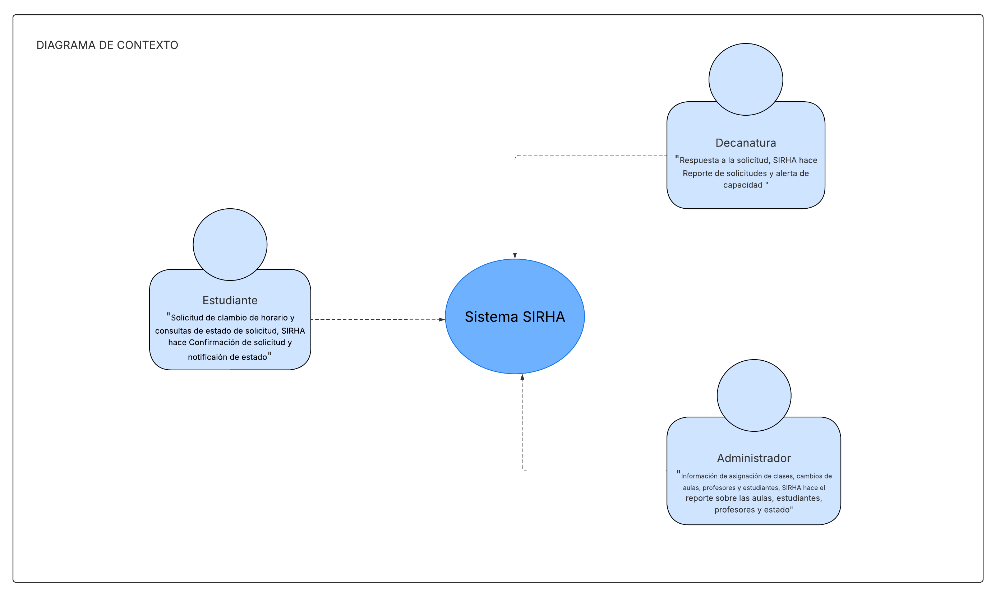
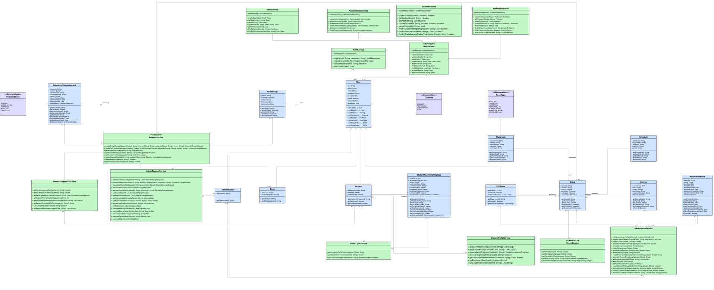
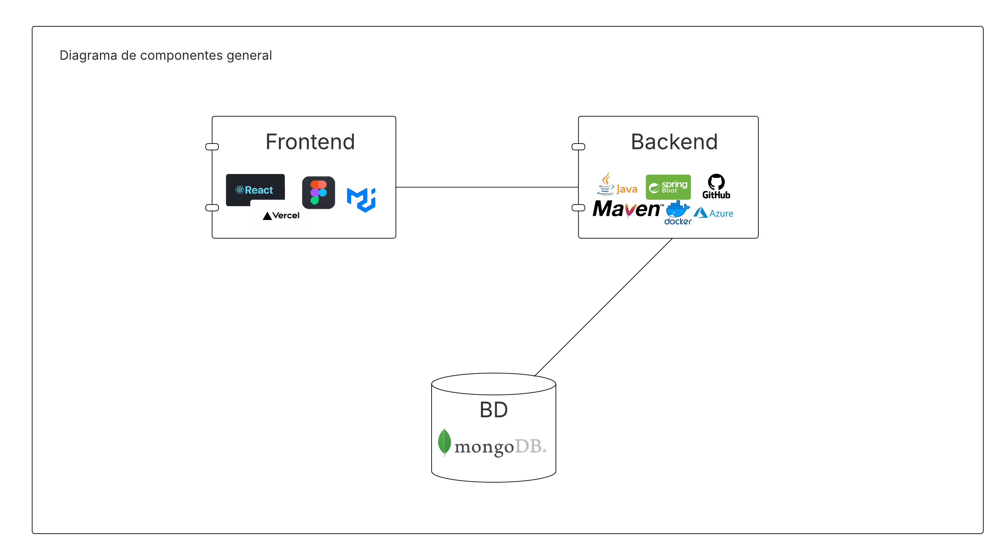
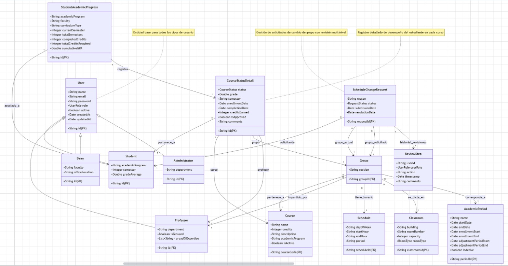
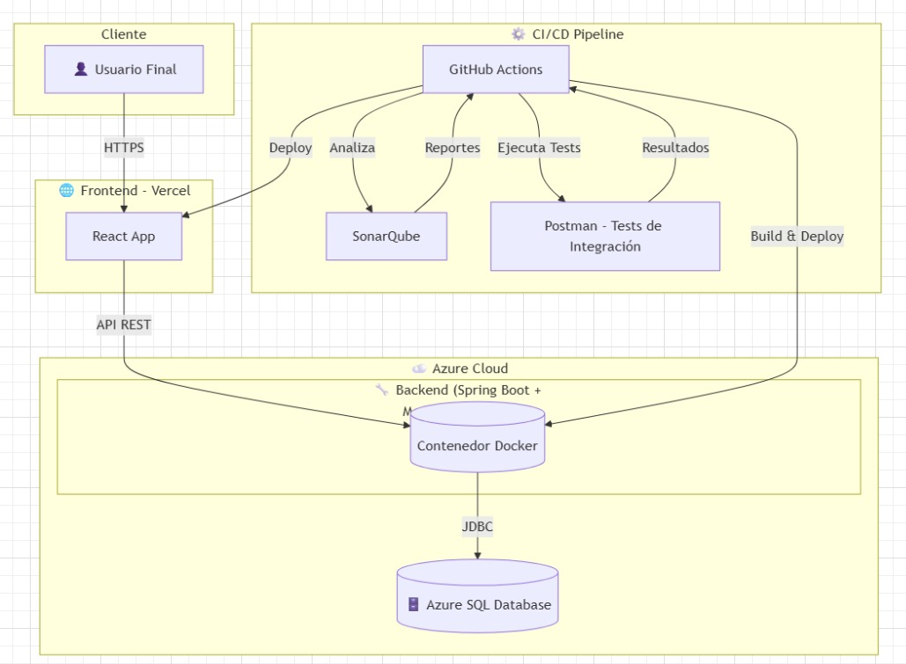

# TEEN_TITANS_BACK

**Integrantes :**
- Sebastian Albarracin Silva
- Raquel Iveth Selma Ayala
- Juan Pablo Nieto Cortes
- Deisy Lorena Guzman Cabrales

---

#  SIRHA - Sistema de Reasignación de Horarios Académicos

> Sistema web para la gestión de solicitudes de cambio de materias y grupos con trazabilidad, priorización y control de capacidad.

---

## Objetivo del Proyecto

Facilitar la gestión de solicitudes de cambio de materia y grupo por parte de los estudiantes, con trazabilidad, priorización y control de capacidad, brindando a profesores y decanaturas las herramientas necesarias para evaluar y aprobar dichas solicitudes.

---

### Estrategia de Versionamiento y Convención de Commits

#### Flujo de Ramas (Git Flow)
- **`main`** → rama estable (producción)
- **`develop`** → integración continua (nuevas funcionalidades probadas)
- **`feature/*`** → desarrollo de nuevas funcionalidades
- **`hotfix/*`** → correcciones urgentes en producción
- **`release/*`** → preparación de releases antes de pasar a producción

#### Convención de Commits
Los commits deben ser claros, breves y con un prefijo que indique el propósito:

- **`feat:`** nueva funcionalidad
- **`fix:`** corrección de errores
- **`docs:`** cambios en la documentación
- **`style:`** formato (espacios, punto y coma, estilo de código, etc.)
- **`refactor:`** refactorización de código sin cambiar la funcionalidad
- **`test:`** adición o corrección de pruebas
- **`chore:`** actualización de dependencias, configuración o tareas varias

#### Ejemplos de Commits
- `feat: implementar creación de solicitudes de cambio`
- `fix: corregir validación de cruce de horarios`
- `docs: actualizar README con diagramas de arquitectura`

---

### SCRUM - JIRA
- **Tablero JIRA**: [Tablero SIRHA](https://mail-team-l5ows73z.atlassian.net/jira/software/projects/SCRUM/boards/1?atlOrigin=eyJpIjoiMWM3NTI5N2NjMDQ5NGEwNzkzYjMwZWIzMWI0NzM1NDgiLCJwIjoiaiJ9)
- **Backlog** priorizado con Historias de Usuario
- **Sprint Backlog** con tareas específicas
- **Sprints completados**
- **Evidencias de dailies y distribución de roles**

---
##  Módulos Principales

- **Gestión de Estudiantes**: Registro, autenticación, consulta de horarios, creación y seguimiento de solicitudes.
- **Gestión por Decanatura**: Revisión, aprobación o rechazo de solicitudes, control de cupos y periodos.
- **Gestión de Grupos y Materias**: Administración de cupos, horarios y profesores.
- **Reportes y Estadísticas**: Historial de cambios, tasas de aprobación, indicadores de avance.

---

## 🛠 Tecnologías Implementadas

### Backend
- Java 17 + Spring Boot 3.x
- PostgreSQL
- JWT para autenticación
- JUnit 5 + Mockito para pruebas
- Jacoco para cobertura
- SonarQube para análisis estático

### Frontend
### Frontend
- [TEEN_TITANS_FRONT](https://github.com/JuanPablo990/TEEN_TITANS_FRONT.git)
- [Lucidchart From](https://lucid.app/lucidchart/1ccd2b6c-b8ad-4b9f-941c-f6828e9532d4/edit?view_items=qrGRL0G_4Eiz&invitationId=inv_7ed48e88-6bab-4d4c-9bd2-3f7fd4c4fed7)

### Herramientas
- Git & GitHub
- JIRA Software
- Slack para comunicación
- Swagger para documentación
- Lucidchart para diagramas

---

## **Diagramas incluidos:**

###  Diagrama de Contexto

### Descripción del Diagrama de Contexto

El diagrama de contexto muestra la interacción general entre el Sistema SIRHA (Sistema de Registro de Horarios Académicos) y los actores externos que participan en el proceso de gestión de horarios universitarios.

#### Estudiante: 
realiza solicitudes de cambio de horario y consultas sobre el estado de sus solicitudes. El sistema SIRHA confirma la recepción de las solicitudes y notifica el estado actualizado al estudiante.

#### Decanatura: 
recibe las solicitudes generadas por el sistema y emite las respuestas correspondientes. Además, SIRHA genera reportes de solicitudes y alertas de capacidad para facilitar la toma de decisiones académicas.

#### Administrador: 
gestiona la información relacionada con la asignación de clases, aulas, profesores y estudiantes. El sistema genera reportes sobre el estado de aulas, docentes y estudiantes, permitiendo una adecuada administración académica.

En conjunto, este diagrama representa el alcance funcional del sistema y define las principales entradas y salidas de información entre SIRHA y los actores involucrados.

###  Diagrama de casos de uso

### Descripción de los Diagramas de Casos de Uso

Los diagramas de casos de uso del sistema SIRHA (Sistema de Registro de Horarios Académicos) ilustran las principales funcionalidades que ofrece la plataforma y cómo interactúan los diferentes actores con el sistema.

#### 1. Actor: Estudiante

El estudiante puede realizar diversas acciones relacionadas con la gestión de sus horarios académicos, como:

Crear solicitud de cambio de horario: el estudiante genera una petición formal para modificar su horario actual.

Leer solicitud de cambio de horario: permite consultar los detalles de una solicitud previamente enviada.

Actualizar o eliminar solicitud: el estudiante puede modificar o cancelar una solicitud según sea necesario.

Consultar estado de solicitudes: muestra el estado actual de las peticiones enviadas.

Consultar información del semáforo académico: brinda orientación sobre su situación académica para saber si puede realizar cambios de horario.

Estas funcionalidades están interrelacionadas mediante relaciones «extend», que indican la dependencia entre consultar, actualizar o eliminar una solicitud.

#### 2. Actor: Decanatura

La decanatura gestiona las solicitudes de cambio y controla la capacidad académica de los grupos. Entre sus funciones se incluyen:

Leer, crear, actualizar o eliminar solicitudes de cambio de horario.

Consultar reportes y estadísticas académicas.

Monitorear la capacidad de los grupos.

Gestionar materias y grupos: creación, actualización o eliminación de asignaturas y grupos.

Estas operaciones permiten mantener actualizada la oferta académica y responder oportunamente a las solicitudes estudiantiles.

#### 3. Actor: Administrador

El administrador es responsable de la configuración general del sistema, con funciones centradas en la gestión de usuarios y recursos:

Crear, leer, actualizar y eliminar profesores y estudiantes.

Controlar la información académica y mantener la integridad de los datos.

En conjunto, estos diagramas muestran cómo el SIRHA facilita la comunicación y administración entre los diferentes actores del entorno académico, optimizando los procesos de cambio de horario y gestión institucional.

###  Diagrama de clases

### Descripción del Diagrama de Clases

El diagrama de clases del sistema SIRHA (Sistema de Registro de Horarios Académicos) muestra la estructura lógica del sistema, las entidades que lo componen y las relaciones entre ellas. Este modelo sirve como base para el diseño e implementación del sistema, permitiendo comprender cómo se organizan los datos y cómo interactúan las diferentes clases de negocio y servicio.

#### 1. Clases principales del dominio

Student, Professor, Administrator y Dean: representan los diferentes tipos de usuarios del sistema. Cada uno posee atributos específicos como id, name, email y métodos relacionados con su gestión dentro del sistema.

Group, Subject y Classroom: modelan los elementos académicos fundamentales, asociando materias, aulas y profesores a los grupos de estudiantes.

ScheduleChangeRequest: gestiona las solicitudes de cambio de horario realizadas por los estudiantes, con atributos como requestId, status, reason y date. Esta clase se relaciona con Student y Group.

StudentAcademicProgress: almacena información sobre el avance académico de los estudiantes y se vincula directamente con Student y Subject.

AcademicPeriod: define los periodos académicos en los que se desarrollan las actividades y se registran las solicitudes.

#### 2. Clases de servicio

Las clases de color verde representan los componentes lógicos encargados de gestionar la lógica del negocio y la comunicación con los repositorios:

StudentService, ProfessorService, AdminService, DeanService: manejan las operaciones CRUD y validaciones correspondientes para cada tipo de usuario.

ScheduleChangeService y StudentRequestService: se encargan de procesar las solicitudes de cambio de horario, verificar disponibilidad y actualizar estados.

ReportService y TeachingLogService: generan reportes, estadísticas y registros de actividades docentes.

#### 3. Relaciones

Existen asociaciones entre Student, Group y ScheduleChangeRequest, lo que permite relacionar los usuarios con sus solicitudes y clases.

Se utilizan composiciones entre las clases Group, Subject y Classroom para reflejar la estructura académica.

Los servicios interactúan con los repositorios correspondientes, encargados de la persistencia de datos.

#### 4. Propósito general

El modelo de clases define la arquitectura de la aplicación, separando las responsabilidades en capas (entidades, servicios y repositorios) para mantener una estructura organizada, escalable y coherente con los principios de diseño orientado a objetos

### Diagrama de Componentes

#### Diagrama de Componentes General

### Descripción del Diagrama de Componentes General

El diagrama de componentes general representa la arquitectura global del sistema SIRHA (Sistema de Registro de Horarios Académicos), mostrando la interacción entre las principales capas tecnológicas: Frontend, Backend y Base de Datos.

#### Frontend:
Desarrollado con React, utiliza Material UI para el diseño visual y Vercel como plataforma de despliegue. Esta capa se encarga de la interfaz de usuario, permitiendo la interacción de los estudiantes, administradores y decanatura con el sistema a través de un entorno web moderno y dinámico.

#### Backend:
Implementado en Java con el framework Spring Boot, gestionado con Maven para el manejo de dependencias y compilación del proyecto. El backend procesa la lógica de negocio, administra los servicios del sistema y controla el acceso a los datos. Además, integra herramientas como Docker para la contenedorización, GitHub para el control de versiones y Azure para el despliegue en la nube.

#### Base de Datos (BD):
El sistema utiliza MongoDB, una base de datos NoSQL orientada a documentos que facilita el manejo flexible y escalable de la información académica.

La comunicación entre el Frontend y el Backend se realiza mediante servicios RESTful, mientras que el Backend se conecta directamente con la base de datos MongoDB para realizar operaciones de lectura y escritura. Esta arquitectura modular garantiza la escalabilidad, mantenibilidad y rendimiento del sistema.

#### Diagrama de Componentes Específico

### Descripción del Diagrama de Componentes Específico

El diagrama de componentes específico del sistema SIRHA (Sistema de Registro de Horarios Académicos) detalla la arquitectura interna del backend, mostrando cómo se estructuran los diferentes componentes lógicos que conforman la aplicación, así como sus interconexiones y dependencias.

El sistema se organiza en tres capas principales:

#### Capa de Controladores:
Incluye los componentes encargados de recibir las solicitudes del usuario (API REST) y comunicarse con la capa de servicios.

UsersController y AuthController gestionan la autenticación y administración de usuarios.

DeaneryController se encarga de las solicitudes y acciones propias de la decanatura.

RequestsController, ProcessingController y ReportsController manejan la gestión de solicitudes, procesamiento de información y generación de reportes.

AcademicsController administra las operaciones relacionadas con la información académica y los grupos.

#### Capa de Servicios:
Contiene la lógica de negocio del sistema y se encarga de procesar las reglas funcionales.

UserService y AuthService gestionan usuarios, roles y autenticación.

DeaneryService y RequestService administran la creación, validación y actualización de solicitudes académicas.

ProcessingService y RequestManagementService manejan el flujo interno de procesamiento de datos y validaciones.

StatisticsService y ReportingService generan reportes e indicadores de gestión.

SubjectService y AcademicService controlan los datos académicos de materias, aulas y grupos.

#### Capa de Persistencia:
El componente Repository Backend actúa como intermediario entre los servicios y la base de datos MongoDB, donde se almacenan todas las entidades del sistema.

La arquitectura mantiene un flujo unidireccional donde los controladores interactúan con los servicios, y estos a su vez con la capa de persistencia, garantizando una estructura modular, escalable y fácilmente mantenible.

### Modelo de Base de Datos

### Diagrama de despliegue

